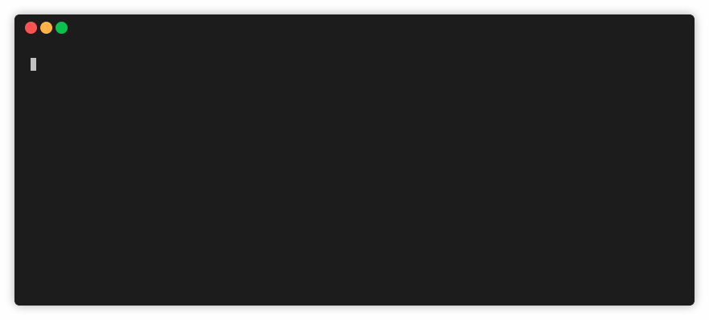
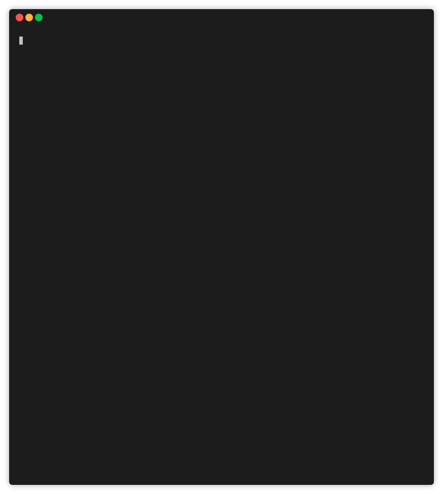
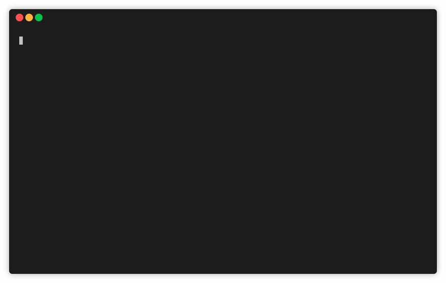
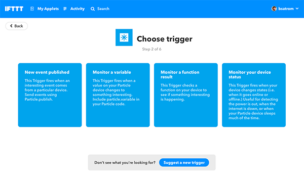
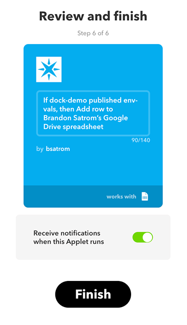
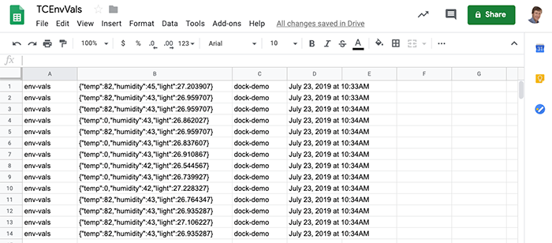
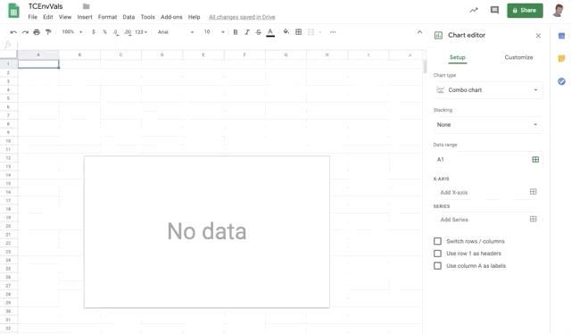

# Chapter 3: Using Particle Webhooks with IFTTT & azure IoT Central

| **Project Goal**            | Use Particle Webhooks and Integrations to connect your app to IFTTT and Azure IoT Central.                                                                                        |
| --------------------------- | ------------------------------------------------------------------------------------------------------------------------------------------------------------------------- |
| **What you’ll learn**       | Working with Particle Integrations, IFTTT and Azure IoT Central |
| **Tools you’ll need**       | Particle Workbench, an [IFTTT.com](https://ifttt.com) account, an [Azure account](https://portal.azure.com), a Particle Argon and the Grove Starter Kit for Particle Mesh                                                                                                           |
| **Time needed to complete** | 60 minutes                                                                                                                                                                |

In this session, we're going to explore the power of Particle integrations, first with the popular IF This Then That (IFTTT) service, then with Azure IoT Central.

## Exploring the Particle CLI and Cloud API

### The Particle CLI

1.  If you haven't already, [install the Particle CLI](https://docs.particle.io/guide/tools-and-features/cli/photon/). Open a terminal window and type the following command:

```bash
bash <( curl -sL https://particle.io/install-cli )
```

2.  Type `particle login` and enter your Particle account email and password when prompted.



3.  Once you're logged in, type `particle list` to see your list of online devices.


4.  The device we've been using for this workshop has 2 variables and one function. Get the value of the `temp` variable with the command `particle get temp`.


5.  We can also call one of the two functions to light up the yellow or blue LED button. Type the command `particle call <your-device-name> toggleLed` in the terminal. Run the same command again to turn the light off.

### The Particle Device Cloud API

Behind the scenes, every interface that Particle provides to work with devices, from the console, to mobile apps, SDKs, and the CLI talks through a RESTful Device Cloud API, which you can also call yourself, directly.

_The next few steps assume you have cURL installed on your machine. If you don't have this command-line utility on your machine, you can download and install it [here](https://curl.haxx.se/download.html) or use a GUI-based tool like [Postman](https://www.getpostman.com/)._

1.  First, you'll need to obtain an access token from the CLI. Type `particle token list` to view the tokens associated with your account. The first one listed is your `user` token, and can be used to access the Device Cloud API. If no tokens are listed, generate a new one with `particle token new`.

2.  With your token and Device ID in hand, type the following cURL command into a terminal window, replacing the text below in `< >` with your information.

```bash
curl https://api.particle.io/v1/devices?access_token=<your token>
```

By default, the response will generate a wall of text in your terminal. If you have Python 2.6+ installed on your machine, you can pipe the output to the `json.tool` and get pretty-printed JSON.

```bash
curl https://api.particle.io/v1/devices\?access_token\=<your token>
| python -m json.tool
```



3.  For this next command, you need the Device ID of the Photon attached to your badge. You can find that in the console or via the `particle list` CLI command.

4.  Let's call the `toggleLed` function using the Device Cloud API. Type the following, again replacing the text below in `< >` with your information.

```bash
curl https://api.particle.io/v1/devices/<device id>/toggleB \
     -d access_token=<your token>
```



You've now explored a number of ways that you can interface with the Particle Device cloud and your connected devices! Now, let's go beyond the Particle ecosystem and explore some of the ways that you can integrate with other 3rd party services, and backhaul your data into other cloud services.


## Introducing the Particle Integrations and IFTTT

### Setting up an IFTTT Integration

IFTTT (If This, Then That) is a web-based service that allows you to create integrations via simple conditional statements, called applets. There are hundreds of pre-built services you can leverage, and first-class support for Particle devices. In this section, we're going to create an IFTTT integration that posts a tweet when you press a button on your badge.

**Note**: During the flow below, you'll need to connect both your Particle and Google accounts with IFTTT. When prompted, follow the on-screen instructions to do so.

1.  Start by heading over to [IFTTT](https://ifttt.com) and either login, or create a new account.


2.  After logging in, click "New Applet" in the top right of your dashboard.


3.  Click the "+this" button.


4.  In the "Search services" input, type "particle" and click on the Particle card.


5.  Click on the "New event published" card.



6. In the trigger fields, set the event name as `env-vals`, leave the Event Content field blank and set the Device name to the name of your device. Click "create trigger."


7. You've set-up the trigger on the Particle end, now its time for the **That**+ portion of the setup. Click the "+that" button.


8. In the action fields, set the spreadsheet name to "TCEnvVals." Leave the defaults in the other fields and click "Create action."


9. Click the "Finish" button to create your applet.




Now, let's modify our device firmware to publish temp and humidity values.

### Refactoring out the blocking delay

First, let's refactor our firmware to remove the `delay` in the loop. While the delay approach is common when getting started with creating embedded applications, it's a blocking operation. This means that any calls you make to the device during a delay may timeout before being received. One common way to write periodic code without using `delay` is to use the built-in `millis()` function and keep track of the elapsed time between the last time we performed an operation (like a temp check) and the wait time between operations.

1. First, let's add some global variables to hold the last check time and an interval. Add the following to the top of your project, outside of the `setup` and `loop`.

```cpp
unsigned long previousCheckMillis = 0;
unsigned long checkInterval = 5000;
```

2. Now, in the `loop`, add a local variable to hold the current time elapsed. The `millis()` function returns the number of milliseconds that have elapsed since your device began running the current program. 

```cpp
unsigned long currentMillis = millis();
```

3. Next, remove the `delay` at the end of your loop function. Then, wrap the rest of the code with an if statement to see if the `checkInterval` time has elapsed. Make sure you also update the `previousCheckMillis` variable to the current `millis` time or this `if` statement will never evaluate to `true` after the first time it runs.

```cpp
if (currentMillis - previousCheckMillis > checkInterval) { 
  previousCheckMillis = millis();

  /* rest of Loop code here */ 
}
```

Your `loop` should now look like this:

```cpp
void loop()
{
  unsigned long currentMillis = millis();

  if (currentMillis - previousCheckMillis > checkInterval)
  {
    previousCheckMillis = millis();

    temp = (int)dht.getTempFarenheit();
    humidity = (int)dht.getHumidity();

    Serial.printlnf("Temp: %f", temp);
    Serial.printlnf("Humidity: %f", humidity);

    double lightAnalogVal = analogRead(A0);
    currentLightLevel = map(lightAnalogVal, 0.0, 4095.0, 0.0, 100.0);

    if (currentLightLevel > 50)
    {
      Particle.publish("light-meter/level", String(currentLightLevel), PRIVATE);
    }
  }
}
```
### Publishing a Payload with Temp and Humidity Values

Now, let's send the current temp, humidity and light level using a `Particle.publish` event. We'll sind a single event with all three values in a single JSON object. To do this, we'll use the `JSONParserGenerator` library.

1. Open the Workbench Command Palette (CMD+SHIFT+P or CTRL+SHIFT+P) and select the "Particle: Install Library" option.

2. In the text box, type "JsonParserGeneratorRK" and click enter.

3. At the top of your project, add an include statement:

```cpp
#include "JsonParserGeneratorRK.h"
```

4. Add a new function to your app called `createEventPayload` that takes the temp, humidity and light readings. This function will create an instance of `JsonWriterStatic` and `JsonWriterAutoObject` objects, insert key-value pairs for each reading, and then get the JSON object as a string buffer that you can send along in a `Particle.publish()` event.

```cpp
void createEventPayload(int temp, int humidity, double light)
{
  JsonWriterStatic<256> jw;
  {
    JsonWriterAutoObject obj(&jw);

    jw.insertKeyValue("temp", temp);
    jw.insertKeyValue("humidity", humidity);
    jw.insertKeyValue("light", light);
  }
}
```

5. Now, let's publish a new event, and call the `createEventPayload` function to provide a formatted JSON string for the data parameter. Add the following to the end of your `createEventPayload` function.

```cpp
Particle.publish("env-vals", createEventPayload(temp, humidity, currentLightLevel), PRIVATE);
```

### Posting sensor values to Google Sheets

1. Flash this firmware to your device and navigate to the Particle console. Every few seconds, you'll see a new `env-vals` event show up.


2. Open Google Drive and look for a folder named "events." In that folder, you'll find a Sheet called "TCEnvVals." Open it, and you'll see a row for each event published by your device:



Now that we have data streaming into Google Sheets, let's transform the data and create some simple visualizations!

### Processing Data in Google Sheets

Before we create data visualizations with our sensor data, we need to transform the sensor values into discrete values. We'll do this by creating a simple script that processes the raw data as it is added to the main sheet, inserting each raw sensor value in a new sheet for data viz.

1. In the "TCEnvVals" document, create a new sheet called "Processed" and give it four columns, "Temp," "Humidity," "Light" and "Time."

2. In the Tools menu, click the "Script Editor" option, which will open a new tab with the Google Apps Script editor.

3. Click on the "Untitled project" text and give the project a name, like "ProcessTCSensorData."

4. Remove the default function code and add an `onChange` event with the following code.

```js
function onChange(e) {
  var row = SpreadsheetApp.getActiveSheet().getLastRow();
  
  var envVals = SpreadsheetApp.getActiveSheet().getRange("B" + row).getValue();
  var time = SpreadsheetApp.getActiveSheet().getRange("D" + row).getValue();
  
  var envObj = JSON.parse(envVals);
  
  if (envObj.temp != '0') {
    var ss = SpreadsheetApp.getActiveSpreadsheet();
    var processedSheet = ss.getSheetByName('Processed');
    processedSheet.appendRow([envObj.temp, envObj.humidity, envObj.light, time]);
  }
}
```

The code above is a JavaScript function that uses the Google Sheets API to get the last row inserted into the main sheet, extract the sensor vals, and the timestamp. The sensor vals are parsed into a JSON object, and then we add a new row to the "Processed" sheet with those values and the timestamp.

5. Save the file.

6. Now, you'll need to add a change trigger to this app. Click the clock icon to open the triggers for this project.


7. Click "Add Trigger" at the bottom left.


8. In the trigger window that opens, make sure that `onChange` is selected as the function name, and "On change" is selected as the event type.


9. Click save to create the trigger. You'll be asked to sign-in with your Google Account and grant access to your app. Follow the on-screen instructions to do so.


10. In the tab for your spreadsheet, select the "Processed" sheet. After a few moments, records should start coming through. 


If you're not seeing anything after a bit, you can click the "Check now" button in your IFTTT Applet.


### Vizualizing Data with Google Sheets

Once you have some processed data, you can add a chart to your sheet!

1. Create a new tab called "DataViz"

2. Click the "Insert" menu and select "Chart."


3. The Chart menu will open on the right side of the window. In the "Chart type" dropdown, select the combination chart type.


4. Click the X-Axis box to open the "Select a data range" window. Navigate to the "Processed" sheet and select the top of the Time tab.



5. Click "Add Series" to open the "Select a data range" window.


6. Repeat the same process to add Series data for the "Humidity" and "Light" columns.


7. Now let's tweak In the Chart editor, click the "Customize" tab and expand the "Series" item. Select the "Temp" series. Then, change the type to "Line."


8. Now select the "Light" series and change the Type to "Columns."


9. Close the chart editor. If everything has been configured properly, you'll see a chart that looks like this.


And that's how you do DataViz with Google Sheets and IFTTT. Now let's explore integrating with Azure IoT Central.

## Integrating with Azure IoT Central

IFTTT is a great tool for intrgrating with a variety of 3rd party tools, but sometimes you need to backhaul your data to a cloud provider for additional processing or routing. Thankfully, Particle Integrations make this easy. 

In this section, you'll explore Azure IoT Central, ingest data and add simple visualizations. First, you'll need to set-up an IoT Hub instance.

### Setting up Azure IoT Central

- Create dashboard

### Using the Azure IoT Central Device Bridge Library

- Installing the firmware lib
- Getting keys and configuring a connection

### Post Temperature and Humidity Values to Azure IoT Central

- Publishing values in firmware
- Making sure the device shows up in Central

### Adding Telemetry to Azure IoT Central

- Explicitly add telemetry values

### Viewing IoT Central Time-Series 

- Viewing time-series charts

### Building Visualizations in IoT Central

- Building guages and charts

### Setting up an Azure IoT Hub

1.  Sign up for an [Azure Account](https://azure.microsoft.com/en-us/get-started/), or sign in if you already have one.


2.  In the dashboard, click "Create a resource." Click "Internet of Things," then "IoT Hub" at the top of the list.


3.  Create a new resource group named `workshop-group` and give the hub a name. The name must be unique across all of Azure, but you'll receive a notification if the name you selected is not unique.


4.  Click "Review + create".


5.  Click "Create".


6.  You'll get a notification that your IoT Hub is being deployed, which may take a few minutes. Once done, pin the hub to your dashboard.


7.  Click "Go to resource" to open the hub.


8.  Click "Shared access policies". We'll create a policy to allow the Particle Device Cloud to stream events into the hub.

9.  Give the policy the name `workshop-policy`, select all four permissions, then click "Create."


10. Open the policy you just created and copy the "Primary key."


Now we can use connect our IoT Hub instance to our Rules Engine flow.

### Using the Azure IoT Hub node

1. Find the "Azure IoT Hub" node under the Azure palette group. Drag it to the workflow surface and connect it to the "To JSON" node.


2. Double-click on the Azure IoT Hub node and set its properties to use `mqtt` as the transport protocol and the name of your IoT Hub as the host.


3. Deploy the latest changes to your flow.

### Viewing IoT Hub Events

With the event set up, everything should be piping into the Azure IoT hub. We can verify using the [iothub-explorer command line utility](https://docs.microsoft.com/en-us/azure/iot-hub/iot-hub-explorer-cloud-device-messaging?WT.mc_id=7061727469636c65).

1.  Install the iothub-explorer using the instructions [here](https://github.com/azure/iothub-explorer).

2.  Navigate to your IoT Hub in the azure portal, and return to your shared access policy, `workshop-policy`. Copy the Connection string. You'll need this to authenticate with the iothub-explorer.


3.  Open a terminal window and type in the following command, replacing the `<device-id>` with the ID of your Electron and pasting the Shared access policy connection string in place of `<connection-string>` after login. Make sure to leave the quotation marks in place.

```bash
iothub-explorer monitor-events <device-id> --login "<connection-string>"
```

If you've authenticated correctly, you'll see the message "Monitoring events from device `<device-id>`...". After a moment, you should see events streaming into the Azure IoT Hub!


Once you're streaming device data into the Azure IoT Hub, you can pipe the data into Azure table storage, set-up streaming analytics to transform the data, create Azure Web Apps, reports with Power BI, use Azure Machine Learning, and more! In the next section, we'll set-up a streaming analytics job and visualize our data in Power BI.

