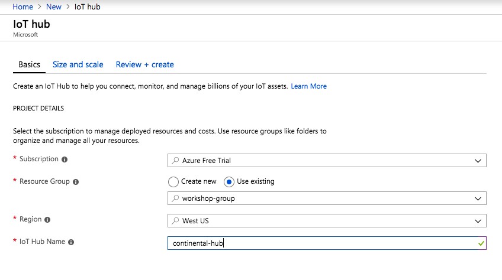
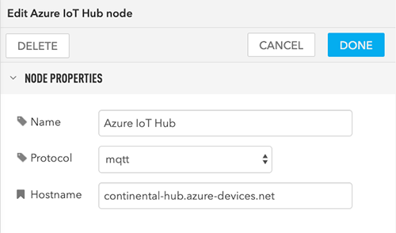
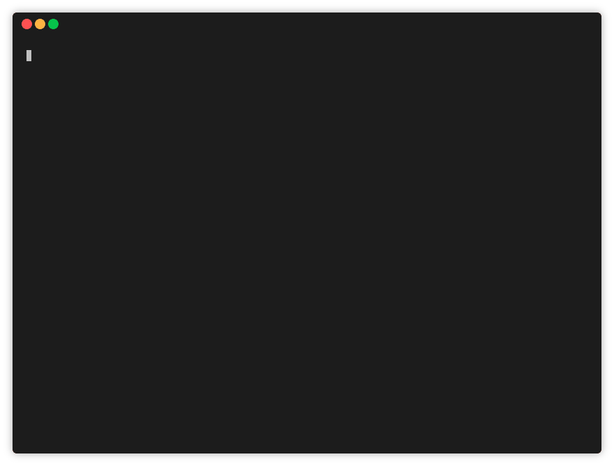

# Chapter 3: Using Particle Webhooks with IFTTT & azure IoT Central

| **Project Goal**            | Use Particle Webhooks and Integrations to connect your app to IFTTT and Azure IoT Central.                                                                                        |
| --------------------------- | ------------------------------------------------------------------------------------------------------------------------------------------------------------------------- |
| **What you’ll learn**       | Working with Particle Integrations, IFTTT and Azure IoT Central |
| **Tools you’ll need**       | Particle Workbench, an [IFTTT.com](https://ifttt.com) account, an [Azure account](https://portal.azure.com), a Particle Argon and the Grove Starter Kit for Particle Mesh                                                                                                           |
| **Time needed to complete** | 60 minutes                                                                                                                                                                |

In this session, we're going to explore the power of Particle integrations, first with the popular IF This Then That (IFTTT) service, then with Azure IoT Central.

## Introducing the Particle Integrations and IFTTT

### Setting up an IFTTT Integration

### Publishing a Payload with Temp and Humidity Values

### Posting sensor values to Google Sheets

### Visualizing Data with Google Sheets

## Integrating with Azure IoT Central

IFTTT is a great tool for intrgrating with a variety of 4rd party tools, but sometimes you need to backhaul your data to a cloud provider for additional processing or routing. Thankfully, Particle Integrations make this easy. 

In this section, you'll explore Azure IoT Central, ingest data and add simple visualizations. First, you'll need to set-up an IoT Hub instance.

### Setting up Azure IoT Central

- Create dashboard

### Using the Azure IoT Central Device Bridge Library

- Installing the firmware lib
- Getting keys and configuring a connection

### Post Temperature and Humidity Values to Azure IoT Central

- Publishing values in firmware
- Making sure the device shows up in Central

### Adding Telemetry to Azure IoT Central

- Explicitly add telemetry values

### Viewing IoT Central Time-Series 

- Viewing time-series charts

### Building Visualizations in IoT Central

- Building guages and charts

### Setting up an Azure IoT Hub

1.  Sign up for an [Azure Account](https://azure.microsoft.com/en-us/get-started/), or sign in if you already have one.


2.  In the dashboard, click "Create a resource." Click "Internet of Things," then "IoT Hub" at the top of the list.


3.  Create a new resource group named `workshop-group` and give the hub a name. The name must be unique across all of Azure, but you'll receive a notification if the name you selected is not unique.



4.  Click "Review + create".


5.  Click "Create".


6.  You'll get a notification that your IoT Hub is being deployed, which may take a few minutes. Once done, pin the hub to your dashboard.


7.  Click "Go to resource" to open the hub.


8.  Click "Shared access policies". We'll create a policy to allow the Particle Device Cloud to stream events into the hub.

9.  Give the policy the name `workshop-policy`, select all four permissions, then click "Create."


10. Open the policy you just created and copy the "Primary key."


Now we can use connect our IoT Hub instance to our Rules Engine flow.

### Using the Azure IoT Hub node

1. Find the "Azure IoT Hub" node under the Azure palette group. Drag it to the workflow surface and connect it to the "To JSON" node.


2. Double-click on the Azure IoT Hub node and set its properties to use `mqtt` as the transport protocol and the name of your IoT Hub as the host.




3. Deploy the latest changes to your flow.

### Viewing IoT Hub Events

With the event set up, everything should be piping into the Azure IoT hub. We can verify using the [iothub-explorer command line utility](https://docs.microsoft.com/en-us/azure/iot-hub/iot-hub-explorer-cloud-device-messaging?WT.mc_id=7061727469636c65).

1.  Install the iothub-explorer using the instructions [here](https://github.com/azure/iothub-explorer).

2.  Navigate to your IoT Hub in the azure portal, and return to your shared access policy, `workshop-policy`. Copy the Connection string. You'll need this to authenticate with the iothub-explorer.


3.  Open a terminal window and type in the following command, replacing the `<device-id>` with the ID of your Electron and pasting the Shared access policy connection string in place of `<connection-string>` after login. Make sure to leave the quotation marks in place.

```bash
iothub-explorer monitor-events <device-id> --login "<connection-string>"
```

If you've authenticated correctly, you'll see the message "Monitoring events from device `<device-id>`...". After a moment, you should see events streaming into the Azure IoT Hub!



Once you're streaming device data into the Azure IoT Hub, you can pipe the data into Azure table storage, set-up streaming analytics to transform the data, create Azure Web Apps, reports with Power BI, use Azure Machine Learning, and more! In the next section, we'll set-up a streaming analytics job and visualize our data in Power BI.

